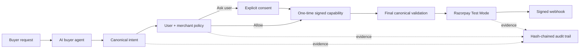
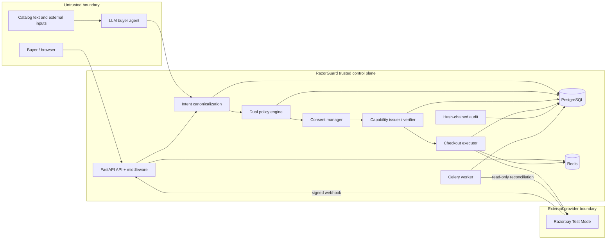
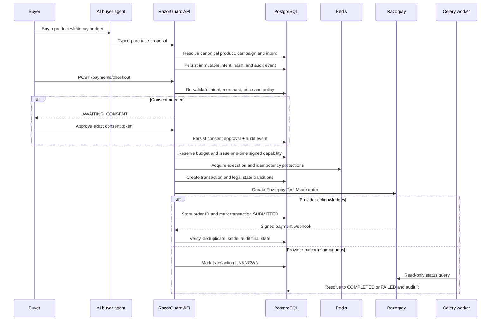
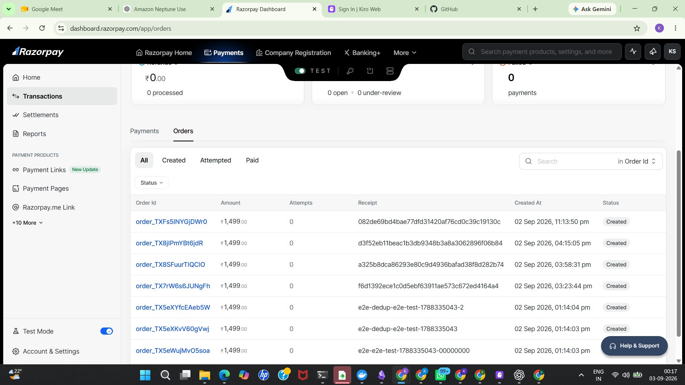

# RazorGuard ACE

> **A zero-trust control plane that lets AI buyers help merchants sell—without giving the AI unrestricted authority to spend.**

**Razorpay AI Buildathon 2026 · Track 01 — AI Growth & Agentic Commerce**

## The 30-second story

An AI buyer can discover a merchant's products, recommend an upsell, apply a merchant-approved campaign, and propose a checkout. RazorGuard then takes over: it validates the canonical product and price, evaluates user and merchant policy, requests explicit consent where needed, issues a one-time cryptographic capability, creates a Razorpay **Test Mode** order, and records each material decision in a tamper-evident audit trail.

**The AI can decide what to propose. It can never decide whether it is allowed to pay.**

## Why this is Track 01

| Buildathon bar | What RazorGuard demonstrates |
|---|---|
| Merchant transactable by an AI buyer, end to end | Buyer chat → agent-readable catalog → canonical intent → guarded checkout → Razorpay Test Mode order → signed webhook settlement. |
| Merchant revenue growth | Complementary-product upsells and merchant-authored campaigns with eligibility, discount, validity, and usage limits. |
| Conversational checkout | Natural language creates an inspectable purchase proposal rather than an unchecked payment. |
| Explainable money actions | Policy result, consent, capability, state transitions, reason, and actor are visible in the Audit Trail. |
| Bounded and gated money actions | Dual policy, explicit consent, budget reservation, one-time capability, final validation, idempotency, and merchant kill switch. |
| One graceful failure | Price drift, duplicate execution, forged webhook, prompt injection, kill switch, and provider timeout are represented as safe outcomes in the Security dashboard. |

## Zero-trust, in human words

AI is excellent at understanding requests and finding products. It is not an authority on money. So RazorGuard separates **reasoning** from **authority**:

```text
AI proposes → trusted service validates → policy decides → user consents
→ capability authorizes one exact purchase → Razorpay executes
→ webhook/reconciliation verifies → audit proves
```

The proposal is bound to a product, merchant, amount, currency, quantity, session, expiry, and policy version. If any of those facts change, the authorization no longer applies.



## Trust boundaries


### What is trusted and what is not

| Component | Trust level | What it may do |
|---|---|---|
| LLM and buyer agent | Untrusted initiator | Search, recommend, propose a typed intent. It cannot approve consent, issue a capability, or call the payment executor. |
| Catalog and protocol payloads | Untrusted data | May inform a proposal; canonical catalog and merchant records are re-read before execution. |
| RazorGuard API/control plane | Trusted enforcement point | Validates requests, runs deterministic policy, binds consent, issues capability, transitions state. |
| PostgreSQL | Financial system of record | Stores policy, consent, intent, capability, transaction, webhook inbox, campaign reservation, and audit evidence. |
| Redis | Supporting security infrastructure | Distributed locks, rate limits, idempotency cache, and Celery broker. Financial correctness must still survive its loss. |
| Razorpay | Payment provider | Creates Test Mode orders and sends signed lifecycle events. |

Read the full [system architecture](docs/architecture/system.md), [authorization model](docs/architecture/authorization.md), [payment state machine](docs/architecture/payment-state-machine.md), and [threat model](docs/architecture/threat-model.md).

## Payment lifecycle and monitoring

## End-to-end payment lifecycle



| Stage | What happens | How it is controlled |
|---|---|---|
| Discovery | Agent reads structured merchant catalog and suggests complements | Tool schemas, bounded agent loop, external text treated as data |
| Intent | Proposal becomes a typed, immutable canonical record | Intent hash, canonical product/merchant checks, expiry |
| Decision | User and merchant rules decide `ALLOW`, `DENY`, or `ASK_USER` | Deterministic dual-sided policy; merchant kill switch |
| Consent | High-risk purchase waits for the exact user approval | Intent-bound, expiring, one-time consent token |
| Authorization | System authorizes one exact checkout | Short-lived signed capability; budget reservation; user/agent/session binding |
| Execution | Razorpay Test Mode order is created | Final price/merchant validation, idempotency, locks, legal state transitions |
| Settlement | Provider outcome becomes final | Signed webhook; `UNKNOWN` is reconciled read-only, never blindly retried |
| Evidence | Reviewer can inspect why and what happened | Correlation IDs, Prometheus metrics, hash-chained audit events |

### Celery 

 Celery is actively used for **unknown-payment reconciliation**, retryable webhook work, and expired campaign-reservation cleanup. In an ambiguous provider timeout, the transaction becomes `UNKNOWN`; the worker queries the existing Razorpay order/payment state and resolves it safely. It does not submit a new payment.

This distinction matters: *queue delay is recoverable; duplicate money movement is not.* A future queue-first checkout path requires a durable outbox/job record and a stable idempotency key before any inline fallback is safe.

## What to demo to a reviewer

1. **AI Assistant** — ask for a product; show a catalog-backed proposal and optional upsell.
2. **Merchant Settings** — create a campaign with category eligibility, discount bounds, usage limit, and validity window.
3. **Control Plane** — run checkout. Show policy, consent if required, capability, execution, and `SUBMITTED` after Razorpay order creation.
4. **Razorpay Test Mode Dashboard** — show the actual order.
5. **Audit Trail** — show the persisted reasoning/evidence chain.
6. **Security Dashboard** — run **price drift** or **forged webhook** and show the system block it without creating an unsafe payment.

**Razorpay Test Mode Dashboard**


## Security properties

| Failure or attack | RazorGuard response |
|---|---|
| Agent/LLM self-authorizes | Impossible by design: the LLM cannot call consent, capability, or execution tools. |
| Catalog prompt injection | Product text is treated as untrusted data; deterministic policy still decides. |
| Price/product/merchant substitution | Intent hash and final canonical revalidation reject the change. |
| Policy or merchant revocation | Final policy/delegation and merchant checks fail closed. |
| Capability replay, theft, or tampering | Short TTL, signature, nonce, one-time use, and identity/session binding reject it. |
| Duplicate payment / concurrency | Deterministic idempotency, Redis coordination, DB uniqueness, and optimistic transaction versioning. |
| Forged/replayed webhook | Razorpay signature verification and persistent event deduplication. |
| Provider timeout | `UNKNOWN`, then read-only Celery reconciliation—never a blind re-charge. |

## Tested evidence

The suite includes focused unit and security coverage for the core claims:

- Buyer agent boundaries and structured proposal handling
- Intent integrity, expiry, canonical catalog validation, and price drift
- Policy rules, merchant controls, campaigns, consent, and capability binding/replay
- Payment idempotency, transaction state transitions, unknown-payment reconciliation, and webhooks
- Prompt injection, authorization-bypass, tampering, and forged-webhook attack paths
- Control-plane, rate-limit, commerce-control, and chaos-failure behavior

Relevant test modules live in [`tests/unit`](tests/unit) and [`tests/security`](tests/security). Run them with the commands below.


## Run locally

### Prerequisites

- Docker Desktop + Docker Compose
- Razorpay **Test Mode** key ID, secret, and webhook secret
- One LLM API key (Groq, OpenAI, Gemini, or Anthropic)

```bash
cp .env.example .env
# Add Razorpay Test Mode and one LLM credential to .env

make docker-up
make migrate
make seed
```

Open the control plane at `http://localhost:3000`; API documentation is at `http://localhost:8000/docs`.

```bash
make test-unit
make test-security
make lint
make typecheck
make smoke
```

## Research and product grounding

RazorGuard adapts established ideas instead of treating “agentic payments” as a blank slate:

| Reference | What RazorGuard takes from it |
|---|---|
| [Google Research: third-party initiation in real-time payments](https://research.google/pubs/design-principles-for-third-party-initiation-in-real-time-payment-systems/) | An agent is an untrusted third-party initiator; initiation and authorization must be separate. |
| [SoK: Blockchain Agent-to-Agent Payments](https://arxiv.org/html/2604.03733v1) | Discovery → authorization → execution/settlement → accounting; strong intent binding, final validation, and accountability address weak binding and payment/service decoupling. |
| [Razorpay Pay on Behalf](https://razorpay.com/blog/introducing-razorpay-pay-on-behalf/) | Delegation must be explicit, bounded, and auditable—not unlimited payment authority. |
| [Razorpay Agentic Payments](https://razorpay.com/agentic-payments/) and Agent Studio | Merchant guardrails, consent, and keeping payment authority/data outside the LLM. |
| Internal AI engineering notes | Least privilege, validated tool use, bounded loops, idempotent writes, correlation IDs, and audit evidence. |

## Scope and honesty

- Razorpay runs in **Test Mode** only.
- `SUBMITTED` means the Razorpay order was created; a verified webhook establishes the final payment status.
- ACP support is an architecture/demo adapter, not a live ACP network integration.
- Demo identity uses fixed local IDs; a production deployment needs real authentication and tenant identity.
- The system is Dockerized as UI + API + PostgreSQL + Redis + Celery worker. Celery handles durable recovery/maintenance; checkout remains synchronous for this demo.

## Stack

FastAPI · PostgreSQL · Redis · Celery · React/Vite · Razorpay Python SDK · Prometheus · Docker Compose

---

**RazorGuard answers a practical agentic-commerce question: can an AI help a merchant sell more while every rupee remains bounded, explainable, and under human and deterministic control?**
