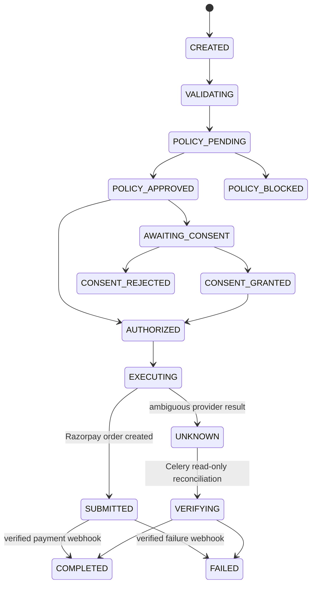

# Payment State Machine and Recovery Model

RazorGuard models uncertain outcomes explicitly. A provider timeout is not a failure and never authorizes a fresh payment attempt.

## Invariants

1. Only legal transitions are persisted; terminal states cannot be reopened.
2. Each transaction has an optimistic version. A stale worker or concurrent writer is rejected.
3. `SUBMITTED` means Razorpay accepted the order creation request. It does **not** claim payment capture.
4. `UNKNOWN` means RazorGuard cannot safely infer the provider outcome. It cannot be retried as a fresh payment.
5. Only signed Razorpay webhooks or Celery's read-only reconciliation settle provider outcomes.
6. Every persisted transition emits a hash-chained audit event in the same database transaction.

## Celery's recovery responsibility

Celery periodically finds `UNKNOWN` transactions, asks Razorpay for existing order/payment status, and writes `VERIFYING → COMPLETED|FAILED`. It never calls order creation as part of reconciliation. This prevents the classic timeout → blind retry → duplicate charge failure.

## Checkout execution mode

Interactive checkout is synchronous in the demo to return the actual pipeline result to the user. Celery is still required for asynchronous recovery, webhook retry, and campaign-reservation expiry.

For a future queue-first checkout design, use a durable outbox/job record and stable idempotency key. Fall back inline only if message publication is definitively rejected; never fall back after an accepted job may already be executing.
