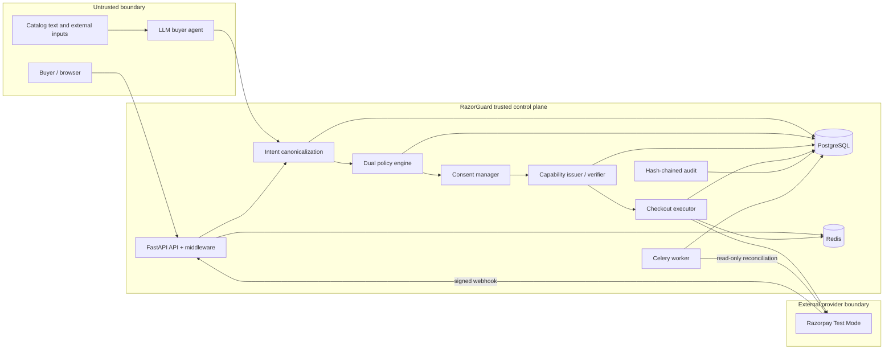
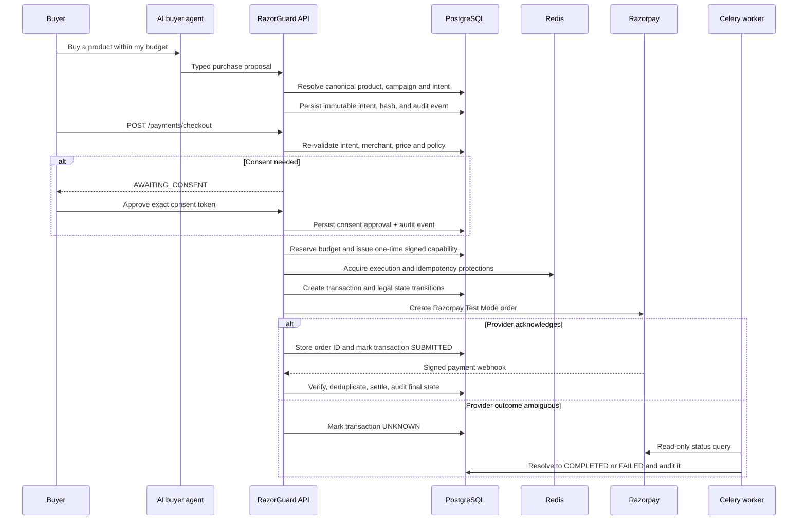
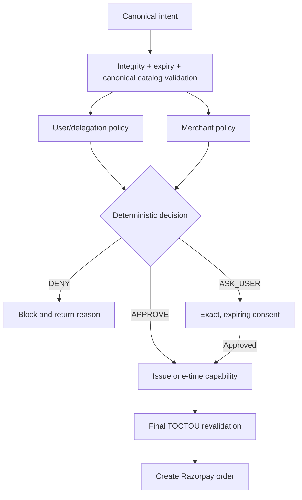

# RazorGuard System Architecture

## Executive view

RazorGuard is a **zero-trust agentic-commerce control plane**. It makes a merchant transactable by an AI buyer without granting an LLM, an agent, or a queue worker general payment authority.

The system has one non-negotiable rule:

> **The agent proposes. Deterministic services authorize. Razorpay executes. Webhooks and the audit trail prove what happened.**

The database is the financial source of truth. Redis improves concurrency control and responsiveness, but never becomes the sole record of a financial decision.

## Trust boundaries



### What is trusted and what is not

| Component | Trust level | What it may do |
|---|---|---|
| LLM and buyer agent | Untrusted initiator | Search, recommend, propose a typed intent. It cannot approve consent, issue a capability, or call the payment executor. |
| Catalog and protocol payloads | Untrusted data | May inform a proposal; canonical catalog and merchant records are re-read before execution. |
| RazorGuard API/control plane | Trusted enforcement point | Validates requests, runs deterministic policy, binds consent, issues capability, transitions state. |
| PostgreSQL | Financial system of record | Stores policy, consent, intent, capability, transaction, webhook inbox, campaign reservation, and audit evidence. |
| Redis | Supporting security infrastructure | Distributed locks, rate limits, idempotency cache, and Celery broker. Financial correctness must still survive its loss. |
| Razorpay | Payment provider | Creates Test Mode orders and sends signed lifecycle events. |

## Runtime components

| Service | Responsibility | Failure posture |
|---|---|---|
| React control plane | Buyer chat, merchant campaigns, pipeline, audit, security view | Displays persisted API state; never authorizes a payment itself. |
| FastAPI API | Synchronous checkout orchestration, policy and consent endpoints, webhook receiver | Fails closed when authorization, DB, or Redis dependencies are unavailable. |
| PostgreSQL | Durable, transactional financial records | Authoritative state and append-only evidence; uses constraints and optimistic transaction versions. |
| Redis | Rate limiting, locks, HTTP idempotency, worker broker | A money operation must not proceed safely without required lock/idempotency guarantees. |
| Celery worker | `UNKNOWN` payment reconciliation, webhook retries, expired campaign-reservation release | Queries provider state; never blindly creates a second payment for an uncertain transaction. |
| Razorpay SDK/API | Creates the provider order | Ambiguous provider failure produces `UNKNOWN`, never assumed failure or success. |

## End-to-end payment lifecycle



### Why checkout is synchronous today

The user-facing checkout pipeline runs in the API request for the demo. The caller receives the actual authorization/payment outcome, which makes the flow easy to inspect and avoids a queue being a hidden dependency for the demo.

Celery remains a **working part of the main system**, not a decorative service: it handles reconciliation of `UNKNOWN` payments, retryable webhook processing, and campaign-reservation cleanup. This is the correct place for asynchronous work because those jobs are durable, idempotent, and do not ask the provider to create a fresh payment.

### Safe queue-first evolution

A future asynchronous checkout dispatcher must use a durable `checkout_job`/outbox record with a stable transaction idempotency key. It may fall back to inline execution **only when queue publication is definitively rejected before a job is accepted**. It must never enqueue, time out waiting, and then submit another payment inline; that creates a duplicate-submission race. The existing `UNKNOWN → reconciliation` path is the safe recovery mechanism after provider ambiguity.

## Authorization and policy decision model



The capability is not a wallet credential. It is a signed, short-lived authorization for **one** intent, binding the user, agent, merchant, product, amount, currency, session, intent hash, policy versions, expiry, and nonce. Any mismatch, expiry, revocation, or replay fails closed.

## State, evidence, and monitoring

### Transaction state model

The implementation advances through `CREATED → VALIDATING → POLICY_PENDING → POLICY_APPROVED → AUTHORIZED → EXECUTING → SUBMITTED`; a signed provider webhook settles it to `COMPLETED` or `FAILED`. An ambiguous provider result becomes `UNKNOWN`, then only read-only reconciliation may advance it through `VERIFYING`.

Legal transitions are validated, terminal states are immutable, and optimistic versions prevent stale concurrent writers.

### Audit model

Every important action carries a request correlation id. Financial transitions are written in the same database transaction as a hash-chained audit event containing actor, action, result, reason, intent/transaction/capability references, and the previous event hash. This supports the reviewer question: **who authorized what, under which policy, and what happened next?**

### Monitoring levels

| Level | Signal | Where it is observed |
|---|---|---|
| L0 — Request | Request ID, structured logs, API latency | API logs and middleware |
| L1 — Agent | Tool calls, bounded agent iterations, proposal result | Buyer-agent logs and metrics |
| L2 — Control | Policy decision, consent state, capability issue/replay | Audit Trail and Security Dashboard |
| L3 — Money | Transaction state, idempotency hit, Razorpay order id | Payments/control-plane views and PostgreSQL |
| L4 — Recovery | Unknown-payment depth, reconciliation outcome, webhook inbox failure | Celery worker, Prometheus metrics, audit events |

## Security controls mapped to failure modes

| Risk | Control |
|---|---|
| LLM/tool prompt injection | Treat external catalog text and model output as data; schema validation and deterministic authorization remain outside the LLM. |
| Price, product, merchant, quantity, or currency substitution | Immutable intent hash and execution-time canonical revalidation. |
| Spending beyond delegation | Dual policy, bounded delegation, budget reservation, and merchant kill switch. |
| Consent forgery or replay | Intent-bound, expiring, one-time consent token and backend verification. |
| Capability theft/replay | Short TTL, signed binding, nonce, one-time consumption, user/agent/session checks. |
| Duplicate charge/concurrent execution | Deterministic idempotency key, Redis protections, DB uniqueness, and transaction version checks. |
| Forged or replayed provider webhook | Razorpay signature verification plus persistent inbox deduplication. |
| Timeout after provider call | `UNKNOWN` status; no blind retry; Celery read-only reconciliation. |

## Deployment topology

Docker Compose runs the UI, API, worker, PostgreSQL, and Redis together. The UI reverse-proxies API calls onto one origin. API and worker share the database but have distinct responsibilities; only the API performs interactive checkout, while the worker performs asynchronous recovery and maintenance.

```text
Browser :3000 → Nginx/React UI → FastAPI :8000 → PostgreSQL :5432
                                      ├── Redis :6379
                                      └── Razorpay Test Mode
Celery worker ────────────────────────┬── Redis broker
                                      ├── PostgreSQL
                                      └── Razorpay read-only reconciliation
```

## Related design references

- Google Research, *Design Principles for Third-party Initiation in Real-time Payment Systems*: agent treated as an untrusted third-party initiator; authorization is intentionally separate from initiation.
- *SoK: Blockchain Agent-to-Agent Payments* (arXiv:2604.03733): discovery → authorization → execution/settlement → accounting lifecycle; intent binding, final validation, and accountability are explicit responses to its identified failures.
- Razorpay Agentic Payments, Agent Studio, Pay on Behalf, and UPI Reserve Pay: bounded delegation, merchant guardrails, explicit consent, and keeping sensitive payment authority out of the LLM.
- Internal AI engineering notes: least privilege, validated tool use, bounded loops, idempotent writes, and correlation/audit evidence.

See [authorization.md](authorization.md), [payment-state-machine.md](payment-state-machine.md), [threat-model.md](threat-model.md), and the security/ADR documents for the detailed control specifications.
